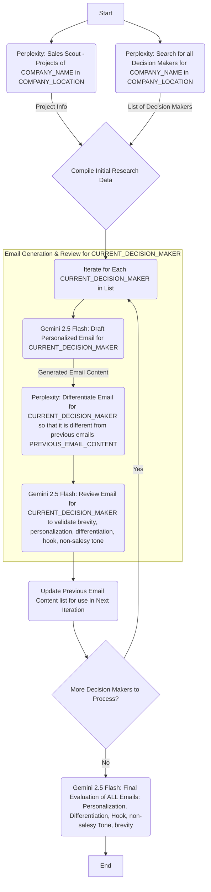

# Emails
# Where to look?
- LinkedIn groups
- Databases:
    - ZoomInfo
    - LinkedIn Sales Navigator
    - Apollo.io
    - Crunchbase
    - Clearbit
    - Hunter.io
- Industry associations and trade groups
- trade shows and conferences
- Social listening:
    - Twitter
    - Reddit
    - Facebook groups
    - hootsuite
    - forums

# What to look for?
- companies that match IPC
- roles of those companies
- segment leads by role (e.g. C-level, VPs/Directors, Middle Management, etc.)
- Send initial outreach email to the leads

# Initial outreach email 
## Structure
Subject line:
Personalized Hook: "Saw you're hiring SDRs — seems like you're scaling fast."
Value Proposition: "We help sales teams automate lead qualification so reps focus only on warm prospects."
Call to Action: "Worth a quick call next week to see if this fits your plans?"

## Personalization
The hook will only be as effective as it matches the current situation of the lead.
Use what the company is doing right now, what goal is the lead working towards
Who is the lead trying to compete with?
What are the problems the lead is facing?

e.g.
Hi Graeme,

The Jansen Group really stood out to me (compliment company). We're reaching out to you as the CFO. 

We want to contribute to The Jansen Group's mission by bringing your payments operations to a competitive industry standard.

Hi Graeme,

I just came across The Jansen Group on LinkedIn. It really seems like a great company that cares about serving clients well.

The Jansen Group actually does seem like a good fit for what we do. We help growing companies streamline their payments operations to industry competitive standard. Let me know if you'd be interested in a mutual opportunity. 

As a CFO, you understand the importance of staying competitive in a rapidly evolving market. We've helped many
growing companies achieve competitive industry standard and streamlined payment operations by:

 - Cutting overhead and payment costs.
 - Combatting fraud risk.
 - Increasing cash flow efficiency.
 - Removing reconciliation and reporting pains.
 - Allowing scalable growth without payment bottlenecks.

Positioning The Jansen Group for future growth and agility in your financial operations.

I see this as a mutually opportunity where we can contribute to the The Jansen Group's mission.

Would you be open to a brief conversation?

Gemini assisted
## Template email
Subject: Quick thought on The Jansen Group & growth

Hi Graeme,

I came across The Jansen Group today, and as someone focused on operational efficiency, I was particularly impressed by [choose ONE specific, genuine compliment]:

"...your work transforming spaces like the 'Backyard Bliss' project – clearly a strong focus on client satisfaction and high-quality delivery." (If you saw specific projects on their site)
"...your team's consistent growth and expansion in the Edmonton market over the last few years." (If you saw growth figures or news)
"...the way you've scaled your operations to manage complex landscaping projects across the region." (If you noticed large project sizes or multiple service offerings)

My team helps growing companies, especially those with significant operational demands like yours, ensure their payment processes are as efficient and robust as their core services. We've often found small improvements in that area can have a big impact on cash flow and team time.

I don't want to make assumptions, but I was curious if optimizing payment operations is something on your radar given The Jansen Group's growth trajectory.

Best,

[Your Name]
[Your Title]
[Your Company]
[Your LinkedIn Profile (Optional, but good for building rapport)]

## Graeme email
Subject: Quick thought on The Jansen Group & growth

Hi Graeme,

I came across The Jansen Group today, and as someone focused on operational efficiency, I was particularly impressed by your work transforming spaces like the Urban Sanctuary project in Edmonton. 
The detailed focus on gardening, sustainability, custom features like the multi-level patio and outdoor kitchen, and even the smart use of repurposed materials, clearly demonstrates a strong commitment to both client satisfaction and high-quality, innovative delivery.

My team helps growing companies, especially those with significant operational demands like yours, ensure their payment processes are as efficient and robust as their core services. 
We've often found small improvements in that area can have a big impact on cash flow and team time.

I don't want to make assumptions, but I was curious if optimizing payment operations is something on your radar given The Jansen Group's growth trajectory and impressive project scope.

Best,

[Your Name]
[Your Title]
[Your Company]
[Your LinkedIn Profile (Optional, but good for building rapport)]

## Adam email
Subject: Strategic opportunity for The Jansen Group’s continued growth

Hi Adam,

I recently learned more about The Jansen Group and was genuinely impressed by how you’ve positioned the company as a leader in high-end landscaping and outdoor living across Edmonton and beyond.
Projects like Dockside Dream and Birch Cove showcase not only your team’s creativity and craftsmanship, but also your ability to deliver complex, large-scale solutions that truly elevate your clients’ properties.

As your company continues to scale and take on increasingly ambitious projects, I wanted to share a quick thought: many growing firms are finding that optimizing their payment operations can unlock meaningful improvements in cash flow, client experience, and team efficiency. 
My team specializes in helping companies like yours ensure their payment processes are as robust and innovative as their core services.

I’d be curious to hear if streamlining payment operations is something you’re considering as part of The Jansen Group’s growth strategy.
Even small enhancements in this area can have a surprisingly big impact as you continue to expand your footprint and take on new challenges.

Best,

[Your Name]  
[Your Title]  
[Your Company]  
[Your LinkedIn Profile (Optional)]

## AI driven personalized email process
* perplexity:
can you be a sales scout and find out what projects <company> from <location> has worked on
* gemini 2.5 flash
Can you draft a personalized email following this template and personalize it using the description of projects they have completed.
<email template>
<output from previous perplexity search>
* perplexity:
search for all the decision makers I should make an email for, for <company> in <location>
* perplexity:
I wrote an email for <staff_1>, Can you help me write a differentiated email for <staff_2>?
Here is my email I wrote for <staff_1>
<email for <staff_1> (produced by Gemini)>
* gemini 2.5 flash:
This is the email that another AI model came up with for <staff_2> who is <staff_2_role> of <company>. Can you review it
<email for <staff_2> (produced by Gemini)>
* gemini 2.5 flash:
So are these emails both personalized, differentiated, and hooking enough for both people for initial sales outreach?
<email for staff_1>
<email for staff_2>
Do these emails sound too salesy or are they casual enough to be effective?

# When to send the email
## Best time of day
- Early morning (6–9 AM local time) is consistently shown to yield the highest reply rates for cold outreach, as your message is likely to be seen first when decision makers check their inboxes, and to be at the top of their inbox when they start their day.

## Best day of week
- Tuesday and Thursday are widely regarded as the best days for B2B emails, with Tuesday often slightly edging out Thursday for engagement rates.

- Avoid Mondays and Fridays: Mondays are busy with catch-up and meetings, while Fridays see lower attention as people wrap up their week.

- Avoid sending right before or after major holidays, and be mindful of fiscal period ends when decision makers may be busier.

## Should You Send at the Same Time?
- Yes, sending both emails at the same optimal time is effective. It increases the chance that at least one decision maker opens and acts on your message, and if one forwards it internally, it creates positive reinforcement.

- Make sure each email is personalized and relevant to the recipient’s role,

# AI-Driven Personalized Sales Email Process Flowchart
Below is the Mermaid diagram representing your AI-driven personalized sales email process.
This diagram visually outlines each step, including the parallel initial research, the iterative email generation and review for multiple decision-makers, and the final evaluation.

