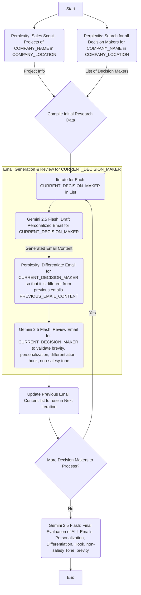

# Emails
# Where to look?
- LinkedIn groups
- Databases:
    - ZoomInfo
    - LinkedIn Sales Navigator
    - Apollo.io
    - Crunchbase
    - Clearbit
    - Hunter.io
- Industry associations and trade groups
- trade shows and conferences
- Social listening:
    - Twitter
    - Reddit
    - Facebook groups
    - hootsuite
    - forums

# What to look for?
- companies that match IPC
- roles of those companies
- segment leads by role (e.g. C-level, VPs/Directors, Middle Management, etc.)
- Send initial outreach email to the leads

# Initial outreach email 
## Structure
Subject line:
Personalized Hook: "Saw you're hiring SDRs — seems like you're scaling fast."
Value Proposition: "We help sales teams automate lead qualification so reps focus only on warm prospects."
Call to Action: "Worth a quick call next week to see if this fits your plans?"

## Personalization
The hook will only be as effective as it matches the current situation of the lead.
Use what the company is doing right now, what goal is the lead working towards
Who is the lead trying to compete with?
What are the problems the lead is facing?

e.g.
Hi Graeme,

The Jansen Group really stood out to me (compliment company). We're reaching out to you as the CFO. 

We want to contribute to The Jansen Group's mission by bringing your payments operations to a competitive industry standard.

Hi Graeme,

I just came across The Jansen Group on LinkedIn. It really seems like a great company that cares about serving clients well.

The Jansen Group actually does seem like a good fit for what we do. We help growing companies streamline their payments operations to industry competitive standard. Let me know if you'd be interested in a mutual opportunity. 

As a CFO, you understand the importance of staying competitive in a rapidly evolving market. We've helped many
growing companies achieve competitive industry standard and streamlined payment operations by:

 - Cutting overhead and payment costs.
 - Combatting fraud risk.
 - Increasing cash flow efficiency.
 - Removing reconciliation and reporting pains.
 - Allowing scalable growth without payment bottlenecks.

Positioning The Jansen Group for future growth and agility in your financial operations.

I see this as a mutually opportunity where we can contribute to the The Jansen Group's mission.

Would you be open to a brief conversation?

Gemini assisted
## Template email
Subject: Quick thought on The Jansen Group & growth

Hi Graeme,

I came across The Jansen Group today, and as someone focused on operational efficiency, I was particularly impressed by [choose ONE specific, genuine compliment]:

"...your work transforming spaces like the 'Backyard Bliss' project – clearly a strong focus on client satisfaction and high-quality delivery." (If you saw specific projects on their site)
"...your team's consistent growth and expansion in the Edmonton market over the last few years." (If you saw growth figures or news)
"...the way you've scaled your operations to manage complex landscaping projects across the region." (If you noticed large project sizes or multiple service offerings)

My team helps growing companies, especially those with significant operational demands like yours, ensure their payment processes are as efficient and robust as their core services. We've often found small improvements in that area can have a big impact on cash flow and team time.

I don't want to make assumptions, but I was curious if optimizing payment operations is something on your radar given The Jansen Group's growth trajectory.

Best,

[Your Name]
[Your Title]
[Your Company]
[Your LinkedIn Profile (Optional, but good for building rapport)]

## Graeme email
Subject: Quick thought on The Jansen Group & growth

Hi Graeme,

I came across The Jansen Group today, and as someone focused on operational efficiency, I was particularly impressed by your work transforming spaces like the Urban Sanctuary project in Edmonton. 
The detailed focus on gardening, sustainability, custom features like the multi-level patio and outdoor kitchen, and even the smart use of repurposed materials, clearly demonstrates a strong commitment to both client satisfaction and high-quality, innovative delivery.

My team helps growing companies, especially those with significant operational demands like yours, ensure their payment processes are as efficient and robust as their core services. 
We've often found small improvements in that area can have a big impact on cash flow and team time.

I don't want to make assumptions, but I was curious if optimizing payment operations is something on your radar given The Jansen Group's growth trajectory and impressive project scope.

Best,

[Your Name]
[Your Title]
[Your Company]
[Your LinkedIn Profile (Optional, but good for building rapport)]

## Adam email
Subject: Strategic opportunity for The Jansen Group’s continued growth

Hi Adam,

I recently learned more about The Jansen Group and was genuinely impressed by how you’ve positioned the company as a leader in high-end landscaping and outdoor living across Edmonton and beyond.
Projects like Dockside Dream and Birch Cove showcase not only your team’s creativity and craftsmanship, but also your ability to deliver complex, large-scale solutions that truly elevate your clients’ properties.

As your company continues to scale and take on increasingly ambitious projects, I wanted to share a quick thought: many growing firms are finding that optimizing their payment operations can unlock meaningful improvements in cash flow, client experience, and team efficiency. 
My team specializes in helping companies like yours ensure their payment processes are as robust and innovative as their core services.

I’d be curious to hear if streamlining payment operations is something you’re considering as part of The Jansen Group’s growth strategy.
Even small enhancements in this area can have a surprisingly big impact as you continue to expand your footprint and take on new challenges.

Best,

[Your Name]  
[Your Title]  
[Your Company]  
[Your LinkedIn Profile (Optional)]

## AI driven personalized email process
* perplexity:
can you be a sales scout and find out what projects <company> from <location> has worked on
* gemini 2.5 flash
Can you draft a personalized email following this template and personalize it using the description of projects they have completed.
<email template>
<output from previous perplexity search>
* perplexity:
search for all the decision makers I should make an email for, for <company> in <location>
* perplexity:
I wrote an email for <staff_1>, Can you help me write a differentiated email for <staff_2>?
Here is my email I wrote for <staff_1>
<email for <staff_1> (produced by Gemini)>
* gemini 2.5 flash:
This is the email that another AI model came up with for <staff_2> who is <staff_2_role> of <company>. Can you review it
<email for <staff_2> (produced by Gemini)>
* gemini 2.5 flash:
So are these emails both personalized, differentiated, and hooking enough for both people for initial sales outreach?
<email for staff_1>
<email for staff_2>
Do these emails sound too salesy or are they casual enough to be effective?

# When to send the email
## Best time of day
- Early morning (6–9 AM local time) is consistently shown to yield the highest reply rates for cold outreach, as your message is likely to be seen first when decision makers check their inboxes, and to be at the top of their inbox when they start their day.

## Best day of week
- Tuesday and Thursday are widely regarded as the best days for B2B emails, with Tuesday often slightly edging out Thursday for engagement rates.

- Avoid Mondays and Fridays: Mondays are busy with catch-up and meetings, while Fridays see lower attention as people wrap up their week.

- Avoid sending right before or after major holidays, and be mindful of fiscal period ends when decision makers may be busier.

## Should You Send at the Same Time?
- Yes, sending both emails at the same optimal time is effective. It increases the chance that at least one decision maker opens and acts on your message, and if one forwards it internally, it creates positive reinforcement.

- Make sure each email is personalized and relevant to the recipient’s role,

# AI-Driven Personalized Sales Email Process Flowchart
Below is the Mermaid diagram representing your AI-driven personalized sales email process.
This diagram visually outlines each step, including the parallel initial research, the iterative email generation and review for multiple decision-makers, and the final evaluation.

Here is a targeted list of key decision makers at The Jansen Group in Edmonton, Alberta, based on available public data:

## Key Decision Makers: The Jansen Group

**C-Suite & Executive Leadership**
- **CEO: Adam Jansen**
  - As the CEO, Adam Jansen is the primary decision maker for strategic direction, company partnerships, and high-level procurement decisions[5].
  - Notable for his role in Landscape Alberta’s board, indicating industry leadership and network strength[3].

**Managerial and Operational Leadership**
- **Top Management Employees (as per org chart)**
  - RocketReach lists multiple top management employees at The Jansen Group Ltd., though their specific names and titles are not publicly listed in the extract. However, you can expect roles such as Operations Manager, Project Manager, and Director of Sales or Business Development to be represented in the management team[1].
  - Given the company size (11–50 employees), these roles would be directly involved in purchasing, vendor selection, and project execution decisions[5].

**Additional Contacts of Influence**
- **Landscape Industry Board Connection**
  - Adam Jansen’s presence on the Landscape Alberta Board suggests that he is not only the CEO but also a prominent industry influencer, making him a key target for high-value sales outreach[3].
  - If your product or service is relevant to commercial landscaping or construction, outreach to board representatives of industry associations can open additional channels.

## Summary Table

| Title/Role                | Name            | Notes/Position                  |
|---------------------------|-----------------|---------------------------------|
| CEO                       | Adam Jansen     | Highest authority, industry leader, Landscape Alberta Board[3][5] |
| Top Management (Org Chart)| Not Listed      | Includes ops, sales, projects   |
| (External) Board Member   | Adam Jansen     | Industry association influence  |

## Recommendations for Sales Outreach

- **Primary Target:** Adam Jansen, CEO – Ideal for strategic, large-scale, or partnership-related sales.
- **Secondary Targets:** Top management staff listed in The Jansen Group’s management chart – Relevant for product, service, or operational procurement decisions[1].
- **Industry Influence:** Leverage Adam Jansen’s board position for introductions or broader industry credibility[3].

**Note:** For comprehensive outreach, attempt to identify the specific names and titles of the management team via RocketReach or similar business intelligence tools, as the full list is not available in the public extract[1].

## Example Initial Outreach Strategy

1. **First Email:** Address Adam Jansen as CEO, referencing his leadership and industry involvement.
2. **Follow-Up:** Engage with management roles (Operations, Sales, Project Management) for product-specific discussions.
3. **Leverage Associations:** Mention Landscape Alberta if your solution is relevant to the broader industry.

This approach will maximize your chances of reaching all key decision makers at The Jansen Group."

## inbound

Here's an analysis of the provided news items from an experienced software engineer's perspective, generating X/Twitter content for each:

---

### News Item 1: Apple Unveils Metal 4 with AI-Powered Graphics API

**Engineer's Analysis:**
This is a significant move. Integrating AI directly into a graphics API like Metal means native Mac applications can now perform computationally intensive AI tasks on the GPU without relying on cloud services. This has huge implications for performance, privacy, and user experience. It empowers local processing, reducing latency and data transfer costs. For developers, it means a potential shift back towards optimizing for powerful edge devices, requiring a deeper understanding of on-device AI model deployment and optimization rather than just API calls to cloud services. It challenges the "cloud-first" paradigm for AI inference.

---

**X/Twitter Content Pieces for News Item 1:**

**Content Pillar: Industry Trends / Strategic Insights**
**X/Twitter Content:**
Apple's Metal 4 just dropped, embedding AI directly into the graphics API. This isn't just about fancy visuals; it's a massive push for *on-device AI inference*. Latency down, privacy up. Are we witnessing a subtle shift back from cloud-first to edge-first AI for consumer apps? Big implications for architecture decisions.
#Metal4 #EdgeAI #OnDeviceAI #AIDevelopment

---

**Content Pillar: Technical Deep Dive / Best Practices**
**X/Twitter Content:**
With Metal 4, Mac developers now have a native path to run complex AI workloads directly on the GPU. Forget cloud latency for inference! If you're building compute-heavy apps, it's time to dig into model quantization & efficient inference graphs. M-series silicon + Metal 4 is a powerhouse combo.
#AppleDev #MLOps #GPUComputing #NativeAI

---

**Content Pillar: Provocative Thought / Challenging the Status Quo**
**X/Twitter Content:**
Everyone's been screaming "cloud-native AI!", but Apple just dropped Metal 4 enabling deep AI on the device. Is the perceived inevitability of cloud compute for *all* AI tasks truly holding up? Or is Apple reminding us the edge can be incredibly powerful and private? Rethink your inference strategy.
#CloudVsEdge #AIDebate #DeveloperStrategy #AppleWWDC

---

### News Item 2: Gartner Highlights AI-Native Software Engineering as a Strategic Trend for 2025+

**Engineer's Analysis:**
Gartner's prediction isn't surprising – AI code assistants are already widespread. The key takeaway is the shift from "manual coding" to "orchestration and problem-solving." This means engineers will increasingly be responsible for prompting, validating, integrating, and debugging AI-generated code, rather than writing every line themselves. The value proposition for engineers shifts from rote coding to higher-level design, critical thinking, and ensuring the *quality* and *correctness* of AI outputs. It also highlights the importance of adapting workflows and tooling to effectively integrate these assistants.

---

**X/Twitter Content Pieces for News Item 2:**

**Content Pillar: Industry Trends / Strategic Insights**
**X/Twitter Content:**
Gartner: 90% of enterprise devs using AI assistants by 2028. This isn't about code generation; it's about transforming dev roles. We become AI orchestrators, problem definers, and critical evaluators. Our value shifts from typing speed to architectural insight and prompt engineering. The future of SE is collaborative intelligence.
#AIDev #FutureOfWork #SoftwareEngineering #TechTrends

---

**Content Pillar: Developer Advocacy / Community Building**
**X/Twitter Content:**
AI code assistants are here to stay. This is your cue to level up beyond just writing code. Master prompt engineering, learn to critically review AI-generated solutions (spotting subtle bugs is key!), and adapt your dev workflow. The most valuable engineers will be those who can leverage AI efficiently AND maintain high quality. What's your strategy?
#DeveloperSkills #AIinDev #Upskilling #CareerAdvice

---

**Content Pillar: Provocative Thought / Challenging the Status Quo**
**X/Twitter Content:**
Tweet 1/2: Gartner says 90% of devs will use AI code assistants. Cool, faster code. But are we risking a generation of engineers who understand *less* about the underlying systems, relying too much on AI's black box outputs?
Tweet 2/2: The real challenge won't be AI's capability, but our ability to maintain deep system understanding, critical thinking, and rigorous code review processes *despite* the AI doing the heavy lifting. Don't let AI make you complacent.
#CodeQuality #AIethics #SoftwareCraftsmanship #DeveloperDebate

---

### News Item 3: Apple Commits $500 Billion to US AI Infrastructure and R&D

**Engineer's Analysis:**
A half-trillion-dollar investment is staggering and signals Apple's extremely serious commitment to AI, particularly in hardware and fundamental research. This isn't just about building better iPhones; it's about solidifying their position in the entire AI stack, from silicon to software, and directly challenging giants like NVIDIA and Google. For developers, this means a massive expansion of opportunities within the Apple ecosystem and potentially highly optimized, tightly integrated hardware/software solutions that could set new performance benchmarks. It also creates a huge demand for AI talent.

---

**X/Twitter Content Pieces for News Item 3:**

**Content Pillar: Industry Trends / Strategic Insights**
**X/Twitter Content:**
Apple's $500B AI investment is a strategic earthquake. This isn't just R&D; it's new chip fabs, 20k jobs, university partnerships. They're going all-in on vertical integration for AI, aiming to control the entire stack. Expect an arms race in AI hardware and highly optimized Apple-specific AI solutions.
#AppleAI #AIChips #TechInvestment #VerticalIntegration

---

**Content Pillar: Developer Advocacy / Community Building**
**X/Twitter Content:**
Looking for your next big career move in AI? Apple's $500 BILLION investment and 20,000 new R&D jobs are a massive signal. If you're into AI infrastructure, chip design, on-device ML, or core AI research, watch this space. Incredible opportunities to shape the future of AI.
#AICareers #TechJobs #AppleDev #MLCommunity

---

**Content Pillar: Provocative Thought / Challenging the Status Quo**
**X/Twitter Content:**
Apple dropping half a trillion into US AI infra. Impressive scale, sure. But does this kind of massive, proprietary investment ultimately centralize AI power even further? What happens to the "open" AI ecosystem when one titan can literally buy up the research, talent, and manufacturing capacity?
#OpenAI #BigTech #AIPower #TechMonopoly

---

### News Item 4: Breakthrough AI Research Advances Semantic Bug Fixing and QA in Software Engineering

**Engineer's Analysis:**
This is exciting news for software quality. Current AI code assistants are great at syntax and boilerplate, but semantic understanding for complex bug fixing (like identifying logical errors or subtle race conditions) has been a holy grail. SemAgent's progress is a significant step, moving beyond simple pattern matching to understanding code intent. However, the caveat remains: AI is a powerful tool, but human oversight and verification are still crucial, especially for critical systems. This means developers will need to understand the *semantics* of their code more than ever, to effectively validate AI-generated fixes.

---

**X/Twitter Content Pieces for News Item 4:**

**Content Pillar: Technical Deep Dive / Best Practices**
**X/Twitter Content:**
Semantic bug fixing via AI is finally getting serious. SemAgent's focus on *context* beyond syntax is a game changer for real-world codebases. This pushes AI beyond linting into true logical debugging. Engineers: get ready to review AI-suggested fixes that might actually resolve complex architectural flaws. Trust, but verify!
#AIinDev #BugFixing #SoftwareQuality #CodeReview

---

**Content Pillar: Industry Trends / Strategic Insights**
**X/Twitter Content:**
The advent of semantics-aware AI for bug fixing and QA marks a major leap in developer productivity. Imagine an AI that truly "understands" your code's intent and can proactively suggest fixes for subtle logic errors. Teams that integrate these advanced AI QA tools effectively will ship higher quality software, faster.
#SDLC #DevOps #AIforDevs #EngineeringEfficiency

---

**Content Pillar: Provocative Thought / Challenging the Status Quo**
**X/Twitter Content:**
Tweet 1/2: Semantic bug fixing by AI sounds like magic. But what happens when SemAgent fixes a subtle bug you didn't even know existed, and you don't fully grasp the fix or its implications?
Tweet 2/2: The challenge shifts from finding bugs to fully understanding *why* the AI fixed them, and whether that fix introduced new, even subtler regressions. Transparency & explainability in AI-driven QA are non-negotiable. Don't blindly trust the black box.
#AIethics #CodeQuality #SoftwareEngineering #DeveloperDilemma"

## content review
"These tweets do indeed lean artificial, and you've hit on some common patterns.

Here's a breakdown of *why* they seem artificial, and then my revised versions to make them sound more human and realistic, as if written by an experienced software engineer on X/Twitter.

---

### Why the Original Tweets Seem Artificial:

1.  **Overly Formal/Academic Language:**
    *   Phrases like "perceived inevitability," "value proposition shifts," "advent of semantics-aware AI," "strategic earthquake," "collaborative intelligence."
    *   The "Content Pillar" labels ("Industry Trends / Strategic Insights," "Technical Deep Dive," "Provocative Thought / Challenging the Status Quo") are internal planning jargon, not how a human engineer would frame their thoughts.
    *   Words like "embedding," "enabling," "committing," "highlights," "advances," "orchestrators" often feel a little too precise or corporate.

2.  **Lack of Personal Voice/Emotion/Engagement:**
    *   They state facts and implications but rarely express genuine excitement, skepticism, or surprise. There's no "wow," "holy cow," "this is wild," or "finally!"
    *   Questions often feel rhetorical or academic, not conversational ("Are we witnessing a subtle shift...?", "Is the perceived inevitability...truly holding up?").
    *   No emojis (which are common in human social media, even professional ones, to convey tone).
    *   The tone is consistently neutral and objective, like a press release or a corporate blog post.

3.  **Repetitive Structure & Phrasing:**
    *   Many start directly with the news item ("Apple's Metal 4 just dropped," "Gartner: 90% of enterprise devs...").
    *   The "Tweet 1/2: ... Tweet 2/2: ..." format, while sometimes used, often feels clunky and a bit too structured for spontaneous human thought. Often, a human would just reply to their own tweet naturally or condense it.

4.  **Slightly Stilted or Unnatural Flow:**
    *   Sentences are often perfectly constructed, sometimes to the point of being stiff.
    *   The transition between ideas can be very logical and smooth, but sometimes lacks the informal jumps or shorthand a human might use.
    *   The direct listing of outcomes ("Latency down, privacy up.") feels a bit like a feature list.

5.  **No "Twitterisms":**
    *   Beyond hashtags, there's a lack of common Twitter language like "IMO," "PSA," "🤯," "👀," "thread," "hot take," "devs," "folks," etc.

---

### Adjusted Tweets (More Human & Realistic)

Here are the revised tweets, aiming for a more natural, engaging, and human engineer's voice. I've focused on:
*   Injecting more personal opinion/emotion.
*   Using more conversational language and contractions.
*   Varying sentence structure.
*   Adding emojis appropriately.
*   Making questions more engaging.
*   Breaking up formal phrasing.

---

### News Item 1: Apple Unveils Metal 4 with AI-Powered Graphics API

---

**Original Engineer's Analysis (Context for me to write better tweets):**
This is a significant move. Integrating AI directly into a graphics API like Metal means native Mac applications can now perform computationally intensive AI tasks on the GPU without relying on cloud services. This has huge implications for performance, privacy, and user experience. It empowers local processing, reducing latency and data transfer costs. For developers, it means a potential shift back towards optimizing for powerful edge devices, requiring a deeper understanding of on-device AI model deployment and optimization rather than just API calls to cloud services. It challenges the "cloud-first" paradigm for AI inference.

---

**X/Twitter Content Pieces for News Item 1:**

**Revised Content Pillar: Industry Trends / Strategic Insights**
**X/Twitter Content:**
WHOA. Apple's Metal 4 just landed, baking AI directly into the graphics API. This isn't just about pretty pixels; it's a HUGE leap for *on-device AI inference*. Think: lower latency, better privacy. Is this the turning point for edge-first AI, away from cloud dependency? Game-changing for app architecture.
#Metal4 #EdgeAI #OnDeviceAI #AIDevelopment

---

**Revised Content Pillar: Technical Deep Dive / Best Practices**
**X/Twitter Content:**
Mac devs, listen up: Metal 4 means native, direct GPU AI workloads. No more messing with cloud latency for inference! If your app is compute-heavy, it's time to master model quantization & efficient inference graphs. M-series silicon + Metal 4 = an absolute beast for on-device ML. 💪
#AppleDev #MLOps #GPUComputing #NativeAI

---

**Revised Content Pillar: Provocative Thought / Challenging the Status Quo**
**X/Twitter Content:**
For ages, we've preached "cloud-native AI" as the only way. Then Apple drops Metal 4, bringing *deep* AI capabilities straight to the device. Is the 'cloud-or-bust' mindset finally being challenged? Edge computing just got a HUGE privacy & power boost. Time to revisit your AI strategy? 🤔
#CloudVsEdge #AIDebate #DeveloperStrategy #AppleWWDC

---

### News Item 2: Gartner Highlights AI-Native Software Engineering as a Strategic Trend for 2025+

---

**Original Engineer's Analysis:**
Gartner's prediction isn't surprising – AI code assistants are already widespread. The key takeaway is the shift from "manual coding" to "orchestration and problem-solving." This means engineers will increasingly be responsible for prompting, validating, integrating, and debugging AI-generated code, rather than writing every line themselves. The value proposition for engineers shifts from rote coding to higher-level design, critical thinking, and ensuring the *quality* and *correctness* of AI outputs. It also highlights the importance of adapting workflows and tooling to effectively integrate these assistants.

---

**X/Twitter Content Pieces for News Item 2:**

**Revised Content Pillar: Industry Trends / Strategic Insights**
**X/Twitter Content:**
Gartner predicts 90% of enterprise devs will use AI assistants by 2028. 🤯 This isn't just about faster code; it's a fundamental shift. We're becoming AI *orchestrators*, problem solvers, and critical evaluators. Our value moves from lines of code to architectural vision & prompt engineering. Future of SE is collaborative!
#AIDev #FutureOfWork #SoftwareEngineering #TechTrends

---

**Revised Content Pillar: Developer Advocacy / Community Building**
**X/Twitter Content:**
PSA for devs: AI code assistants are becoming standard. 🤖 This is your signal to seriously level up! Focus on prompt engineering, critical AI output review (spotting *those* subtle bugs), and workflow adaptation. High-value engineers will master AI leverage *and* maintain top quality. What's your plan for this shift? 👇
#DeveloperSkills #AIinDev #Upskilling #CareerAdvice

---

**Revised Content Pillar: Provocative Thought / Challenging the Status Quo**
**X/Twitter Content:**
Gartner says 90% of devs will use AI assistants. That's faster code, sure. But are we risking a generation of engineers who understand *less* about the systems under the hood, over-relying on AI's 'black box' outputs? 😬 The real challenge isn't AI's power, but our ability to maintain deep system understanding, critical thinking, & rigorous code review *despite* the heavy lifting. Stay sharp, don't get complacent!
#CodeQuality #AIethics #SoftwareCraftsmanship #DeveloperDebate

---

### News Item 3: Apple Commits $500 Billion to US AI Infrastructure and R&D

---

**Original Engineer's Analysis:**
A half-trillion-dollar investment is staggering and signals Apple's extremely serious commitment to AI, particularly in hardware and fundamental research. This isn't just about building better iPhones; it's about solidifying their position in the entire AI stack, from silicon to software, and directly challenging giants like NVIDIA and Google. For developers, this means a massive expansion of opportunities within the Apple ecosystem and potentially highly optimized, tightly integrated hardware/software solutions that could set new performance benchmarks. It also creates a huge demand for AI talent.

---

**X/Twitter Content Pieces for News Item 3:**

**Revised Content Pillar: Industry Trends / Strategic Insights**
**X/Twitter Content:**
HOLY COW. Apple just committed $500 BILLION to US AI infrastructure & R&D. This isn't just R&D budget; it's *new chip fabs*, 20,000 jobs, university partnerships. They're basically building their own AI empire, controlling the whole stack. Expect a serious arms race in AI hardware. 🤯
#AppleAI #AIChips #TechInvestment #VerticalIntegration

---

**Revised Content Pillar: Developer Advocacy / Community Building**
**X/Twitter Content:**
AI engineers & researchers: Are you looking for your next career defining move? Apple's $500 BILLION AI investment + 20,000 new R&D jobs is a siren call. 📢 If you're into AI infra, chip design, on-device ML, or foundational AI research, this is where the action will be. HUGE opportunities! ✨
#AICareers #TechJobs #AppleDev #MLCommunity

---

**Revised Content Pillar: Provocative Thought / Challenging the Status Quo**
**X/Twitter Content:**
Apple just poured half a trillion dollars into US AI infra. The scale is mind-boggling. But... doesn't this kind of proprietary, massive investment centralize AI power even *more*? What happens to the 'open' AI ecosystem when one tech titan can essentially buy up the best research, talent, & manufacturing? 🤔 Food for thought.
#OpenAI #BigTech #AIPower #TechMonopoly

---

### News Item 4: Breakthrough AI Research Advances Semantic Bug Fixing and QA in Software Engineering

---

**Original Engineer's Analysis:**
This is exciting news for software quality. Current AI code assistants are great at syntax and boilerplate, but semantic understanding for complex bug fixing (like identifying logical errors or subtle race conditions) has been a holy grail. SemAgent's progress is a significant step, moving beyond simple pattern matching to understanding code intent. However, the caveat remains: AI is a powerful tool, but human oversight and verification are still crucial, especially for critical systems. This means developers will need to understand the *semantics* of their code more than ever, to effectively validate AI-generated fixes.

---

**X/Twitter Content Pieces for News Item 4:**

**Revised Content Pillar: Technical Deep Dive / Best Practices**
**X/Twitter Content:**
AI for semantic bug fixing is finally hitting its stride! 🤩 SemAgent's focus on *context* (not just syntax) is a game-changer for real codebases. This pushes AI past linting into proper logical debugging. Engineers, get ready to review AI-suggested fixes that tackle complex architectural flaws. Remember: Trust, but verify! ✅
#AIinDev #BugFixing #SoftwareQuality #CodeReview

---

**Revised Content Pillar: Industry Trends / Strategic Insights**
**X/Twitter Content:**
This is a HUGE step for dev productivity: AI that truly understands code *semantics* for bug fixing & QA. Imagine an AI that grasps your code's intent and proactively flags/fixes subtle logic errors. 🤯 Teams integrating these advanced AI QA tools will ship higher quality software, *much* faster. Killer tech!
#SDLC #DevOps #AIforDevs #EngineeringEfficiency

---

**Revised Content Pillar: Provocative Thought / Challenging the Status Quo**
**X/Twitter Content:**
AI semantic bug fixing sounds like magic. ✨ But what happens when SemAgent fixes a subtle bug you *never knew existed*, and you don't fully grasp the fix or its implications? The challenge shifts from *finding* bugs to deeply understanding *why* the AI fixed them, and if it introduced new, subtler issues. Transparency & explainability are key. Don't blindly trust the black box.
#AIethics #CodeQuality #SoftwareEngineering #DeveloperDilemma",
